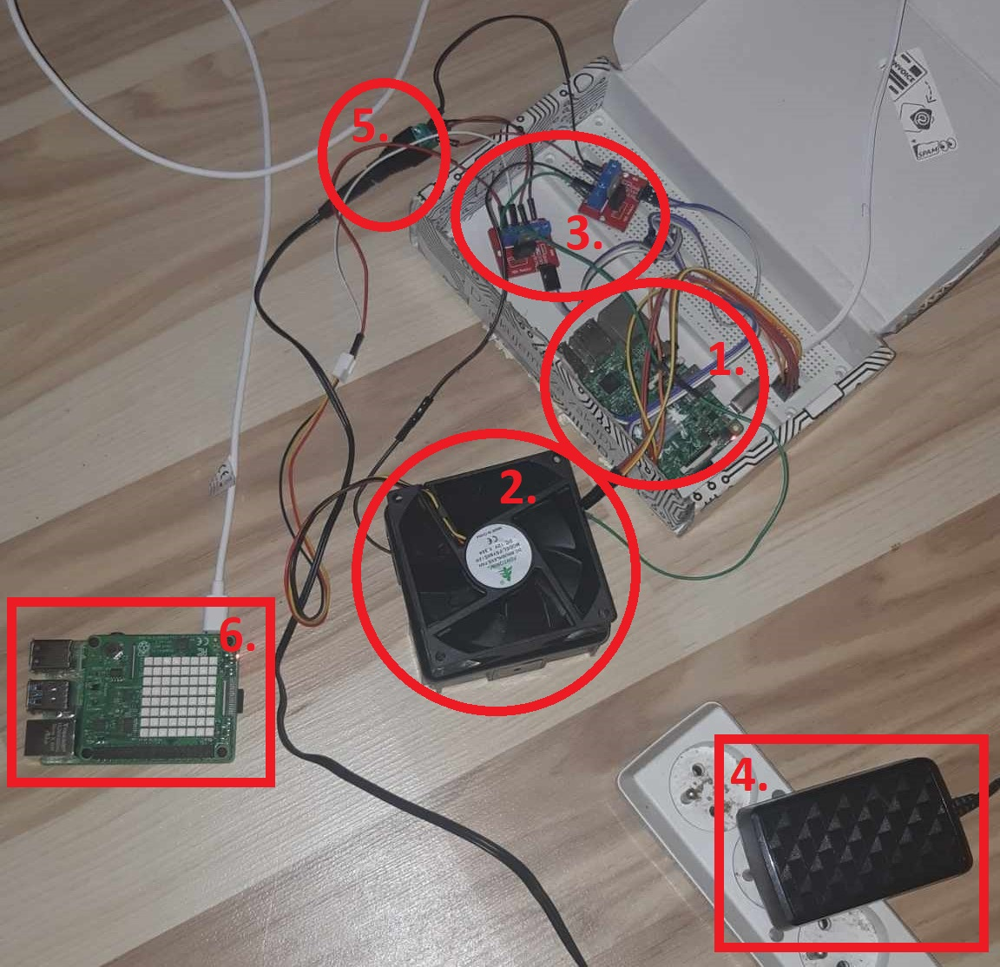
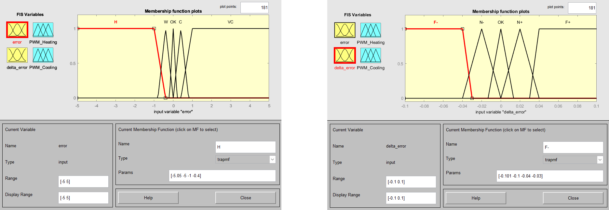
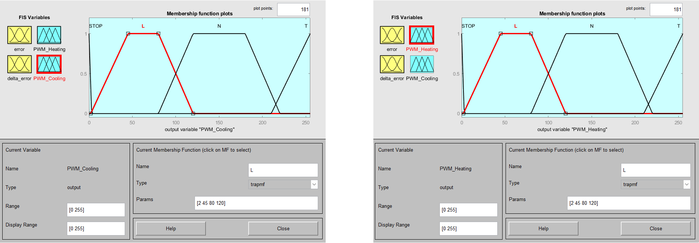
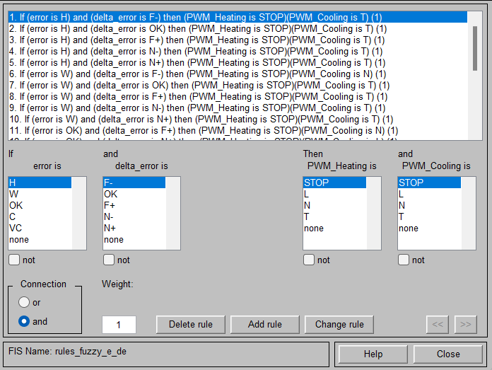
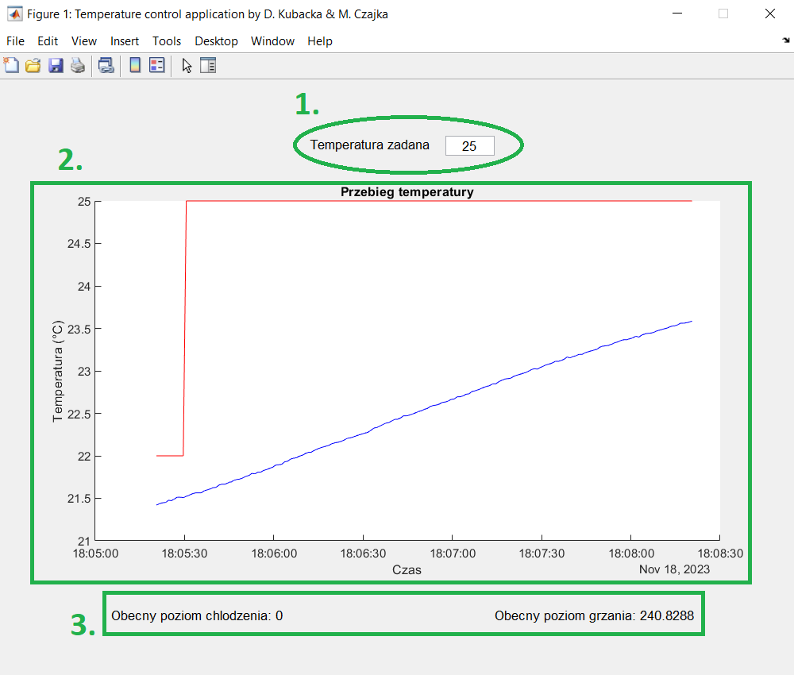
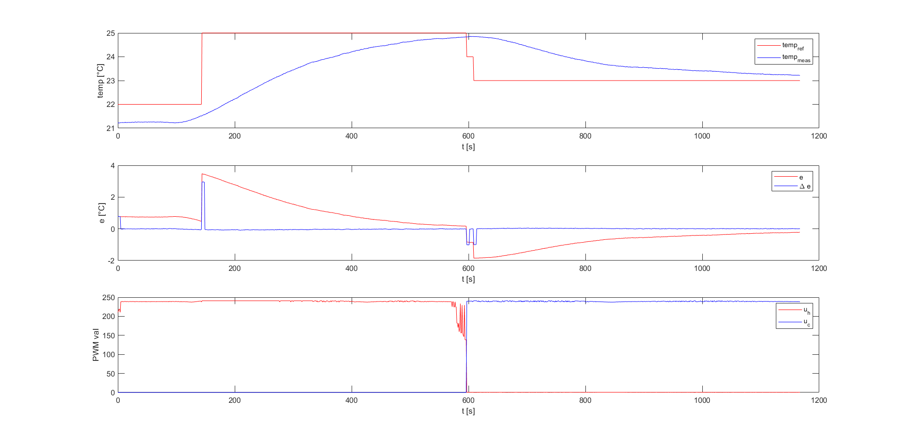

# Temperature control using Fuzzy Logic on Raspberry PI (with MQTT)

Project prepared with [@dariak153](https://www.github.com/dariak153).

Goal of the project was to prepare a window application in Matlab that can be used to control temperature (in this example inside a box) and to see how the temperature is changing over time. For this a Simulink model was created that is being run on Raspberry PI 3B.

> [!IMPORTANT] 
> You need Matlab version R2023b and download [Simulink Support Package for Raspberry Pi Hardware](https://www.mathworks.com/help/supportpkg/raspberrypi/) to run it!

## System

System used in this project can be seen below. Each number corresponds to:

1. Raspberry PI model 3B - running the controller
2. Box with a resistor and temperature sensor inside and fan outside of it
3. IRF520 Transistor
4. AC adapter
5. Connector
6. Raspberry PI model 4 - MQTT broker

## Fuzzy Logic

In the project a Mamdani type fuzzy controller was implemented. It was decided to use error and change of error (delta error) as inputs and duty of PWM for heating and cooling as outputs. 

And rules were defined like shown below:

## Application 

Screenshot of application can be seen below. The numbers correspond to:
1. Input for reference value of temperature
2. Temperature graph
3. Information about current PWM duty (0-255) for Heating and Cooling.

## Results

Built system is working properly, however the results depend on temperature of surroundings. Also some slight changes in structure of the controller might be done to get better results.

